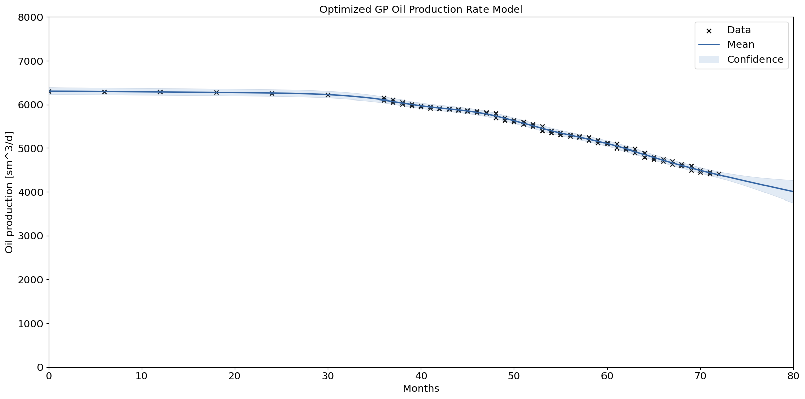

## Reservoir-GP-DT
<div align="center">
  
</div>


&nbsp;\
**Predictive Digital Twin for Reservoir Modeling via Gaussian Processes**
> A padegogical demonstration of the use of Gaussian Processes (GP) as the
> inner workhorse of the Digital Twin for a reservoir model.

&nbsp;\
The primary objective of this project is to train a predictive Gaussian process 
model for reservoir model and characterizations. In particular, the trained GP will
serve as the adopted computation model within the proposed digital twin for a reservoir
which is the corresponding physical twin. 


### Experimental Results
We demonstrated the use of GP to model simple reservoir behaviors, specifically 
for the reservoir pressure behaviors and the oil production rate. We also demonstrate
a simple implementation of GP via spectral sampling.
For more details, you can check out our notebook here:
[Reservoir-GP-DT](./UQPINNs_EX2_BC.ipynb) and [Simple-GP-Model](./UQPINNs_EX2_E.ipynb).


### Citations

You can cite our work here:
```
@misc{Ekarume2024,
title={Predictive Digital Twin for Reservoir Modeling via Gaussian Processes}, 
author={Blessing E. Ekarume and Fadeyi I. Ayoola},
year={2024}
}
```

